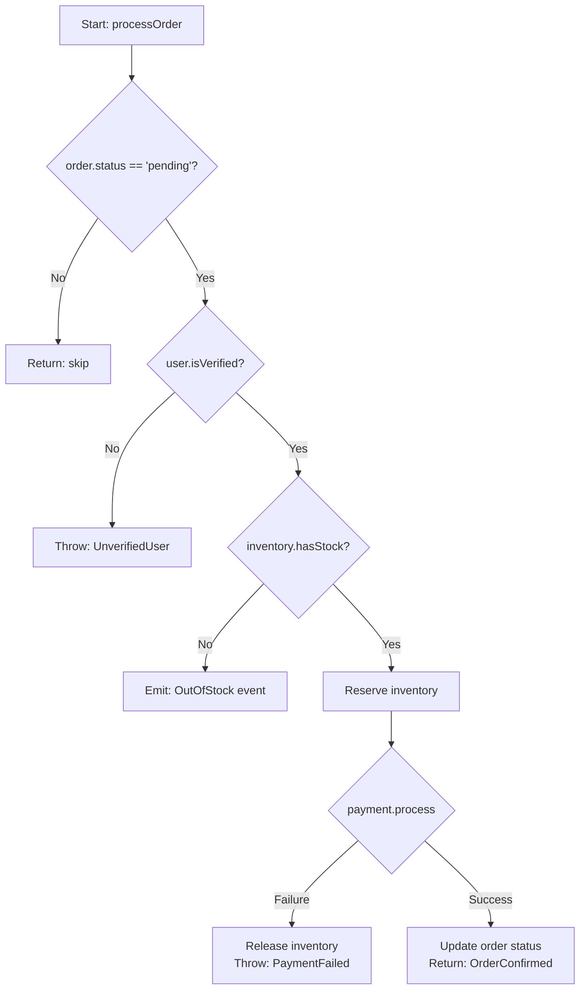

# LogicLens

## Overview

Measures cyclomatic and cognitive complexity of a function or module, produces a Mermaid flowchart of the logic, then refactors using guard clauses, extract method, and strategy/policy patterns. Outputs before/after complexity metrics for every change.

## Workflow

### 1. Measure Baseline Complexity

Before touching any code, compute:

**Cyclomatic Complexity (CC):** Count decision points + 1.
- Each `if`, `else if`, `switch case`, `for`, `while`, `do`, `catch`, `&&`, `||`, `??`, ternary `?` = +1
- Starting score = 1

| CC Score | Rating |
|---|---|
| 1–5 | Simple, low risk |
| 6–10 | Moderate, review recommended |
| 11–15 | High, refactor recommended |
| 16+ | Untestable, must refactor |

**Cognitive Complexity (per SonarSource model):** Penalizes nesting depth. A nested `if` inside a loop scores higher than a flat `if`. Use this as the primary human-readability metric.

Report both scores: `CC: 14, Cognitive: 22 — refactor required`.

### 2. Generate a Flowchart

Produce a Mermaid flowchart to visualize the logic before refactoring:



This makes deeply nested conditionals visible and identifies paths for test coverage.

### 3. Apply Guard Clauses (Early Returns)

Replace nested happy-path conditionals with early returns for all failure/guard cases:

**Before (CC: 9, 4-deep nesting):** Nested `if (pending) { if (verified) { if (hasStock) { ... } } }` — silent fall-through risk.

**After (CC: 5, flat):**
```typescript
function processOrder(order: Order, user: User, inventory: Inventory): OrderConfirmation {
  if (order.status !== 'pending') return;
  if (!user.isVerified) throw new UnverifiedUserError();
  if (!inventory.hasStock(order.productId)) throw new OutOfStockError();
  if (!inventory.reserve(order.productId, order.qty)) throw new ReservationFailedError();
  return confirmOrder(order);
}
```

### 4. Extract Methods

When a function does more than one thing, extract named functions that explain *what*, not *how*. If you need a comment to explain what a block does, it should be a named function:
```typescript
// After: orchestrator + focused helpers
function generateReport(data: ReportData): Report {
  return formatReport(aggregateMetrics(filterReportData(data)));
}
```

### 5. Apply Strategy Pattern for Branching on Type

Replace `if/else`/`switch` chains on type/variant with a strategy map — CC stays flat as new types are added:
```typescript
const paymentProcessors: Record<PaymentMethod, PaymentProcessor> = {
  card: processCard, paypal: processPayPal, crypto: processCrypto,
};
function processPayment(method: PaymentMethod, amount: number): PaymentResult {
  const processor = paymentProcessors[method];
  if (!processor) throw new UnsupportedPaymentMethodError(method);
  return processor(amount);
}
```

### 6. Class/Module-Level Analysis

When analyzing a file or module (not just a single function):
1. List all methods sorted by cyclomatic complexity descending — **tackle the worst method first**.
2. Identify **God class** symptoms: >10 methods, >300 lines, >3 unrelated responsibilities, or direct access to >5 other domain objects.
3. Decompose God classes by extracting cohesive groups of methods + their fields into new, focused classes. Name each class after its single responsibility: `OrderValidator`, `OrderPricer`, `OrderNotifier`.

### 7. Report Before/After Metrics

Always output a metrics table after refactoring:

```
## Complexity Report

| Metric              | Before | After | Change |
|---|---|---|---|
| Cyclomatic Complexity | 14   | 5     | -64%   |
| Cognitive Complexity  | 22   | 8     | -64%   |
| Max nesting depth     | 5    | 2     | -60%   |
| Lines of code (fn)    | 48   | 12    | -75%   |
| Testable paths        | 6    | 6     | 0% (preserved) |
```

## Output Format

Deliver in order:
1. Baseline complexity scores (CC + Cognitive) with explanation.
2. Mermaid flowchart of original logic.
3. Refactored code with inline comments on each technique applied.
4. Before/after metrics table.
5. New unit test cases enabled by the refactor (one per logical path).

## Edge Cases

**Inherently complex logic:** Some complexity is genuine (state machines, protocol parsers). Do not force guard clauses — document with a flowchart, ensure full test coverage, and add a complexity warning comment.

**Side effects inside conditionals:** Flag all side effects (DB writes, event emissions) before refactoring. Verify extracted methods preserve the original call sequence.

**Polymorphism vs. strategy map:** Use a strategy map for stateless, pure variants. Use class-based polymorphism with a factory when variants need different constructor dependencies or stateful config.
